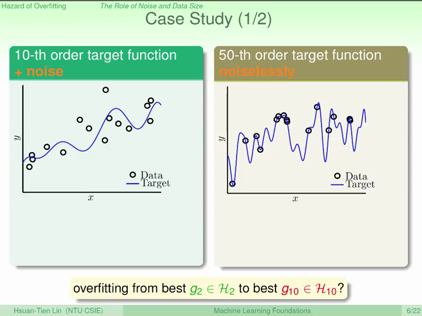

# MachineLearningFoundations
Notebooks for Machine Learning Foundations by @hsuantien

---

## Coursera Links

- [机器学习基石上 (Machine Learning Foundations)-Mathematical Foundations](https://www.coursera.org/learn/ntumlone-mathematicalfoundations)
- [机器学习基石下 (Machine Learning Foundations)-Algorithmic Foundations](https://www.coursera.org/learn/ntumlone-algorithmicfoundations)

by [Hsuan-Tien Lin](https://www.csie.ntu.edu.tw/~htlin/)

## 前言介绍

《机器学习基石》是国立台湾大学资讯工程系的 **林轩田** 老师开设的课程（**中文授课**）。

该课程旨在从基础的角度介绍机器学习，包括机器学习的 **哲学**、关键 **理论** 和核心 **技术** 。

从基础角度出发，既能保证学生能够了解机器学习的基本概念，同时对学生基础的要求最少，也能够保证课程不会太枯燥。

（如果从理论角度出发，需要深入掌握各种机器学习理论，花费大量时间，却不实用；而如果从技术角度出发，虽然可以快速介绍多种机器学习方法，但无法清晰理解，难以帮助应用。）

---

## Lecture 1: The Learning Problem

—— 简介机器学习的概念和基本的数据符号表示

### 哲学思考：什么是`机器学习`？

人：
- 观察 -> 学习 -> 技巧
- Observation -> Learning -> Skill

机器：
- 数据 -> 机器学习 -> 技巧
- Data -> Machine Learning -> Skill

### 下一个问题：什么是`技巧`？

- 改进一些表现
- Improve some performance measure

### 那么，`为什么`要使用机器学习？

因为用传统的编程方式定义、解决某些问题非常难；但使用机器学习的方法可以让这个问题变得很简单。

- 构建复杂的系统

例子：
- 识别什么是树

其他的例子：
- 控制火星探测车（不了解火星的情况）
- 语音识别（难以定义这个问题的解决方法）
- 高频股市交易（人类无法实现）

### 机器学习的三个关键

1. 存在潜在的模式（exists some underlying patten）
  - 这样才存在改进的空间（反例：预测下一个随机数）

2. 无法用简单的编程实现
  - 否则没有必要使用机器学习（反例：识别图中是否存在环路）

3. 必须有能够反映这个问题的数据
  - 否则无法学习（反例：预测核能是否会毁灭人类）


如果有以上三点，那么用机器学习 **有可能** 可以解决这个问题；

### 机器学习的应用举例

略

### 机器学习的组成

数据输入（Input）：


结果输出（Output）：


目标函数（Target function）：


数据集（Data）：


机器学习算法（Learning algorithm）：


函数集合（Hypothesis set）：


假设函数（Hypothesis <=> Skill）：


---

#### 小结：机器学习

机器学习的过程，就是：
- 在**符合**`目标函数`的**数据**上；
- 运用用`机器学习算法`；
- 从`函数集合`中；
- 得到`假设函数`的过程。

机器学习模型是由`机器学习算法`和`函数集合`组成。

### 机器学习（Machine Learning）与其他领域的区别

1. 机器学习 v.s. 数据挖掘（Data Mining）
  - 机器学习和数据挖掘可以互相帮助
  - 机器学习有时包含在数据挖掘中，数据挖掘的范围更加广泛
2. 机器学习 v.s. 人工智能（Artificial Intelligence）
  - 机器学习是实现人工智能的一种方法
  - 机器学习也是一种人工智能，人工智能的范围更加广泛
3. 机器学习 v.s. 统计学（Statistics）
  - 统计学是实现机器学习的一种方法
  - 机器学习更重视计算结构，而统计学更加重视数学的严谨性（当然也损失了很多）

---
---
---

## Lecture 2: Learning Answer Yes/No

—— 介绍感知机（线性分类器）的概念和数学表示

—— 介绍感知机的算法（PLA）和数学表示

—— 数学推导、证明 PLA 的可实现性

### 感知机（Perceptron）

考虑一个简单的分类问题，是否给一个顾客办理信用卡。

假设每个顾客有一系列的特征（Feature），比如年薪、花费、债务等：


计算特征的加权求和作为分数：


如果客户的得分高于某个分数（threshold），则办理信用卡；若低于某个分数，则不办理信用卡。因此有：


这就是**感知机**。

---

简化一下这个公式：


每一种`权重`向量（  ）就是一个假设函数 （Hypothesis）。

在二维空间中（  ），每一种  可以用一条直线表示，在这个直线上的值为0，直线将平面分为 +1 和 -1 两个部分。因此，感知机也叫 **线性分类器（Linear/binary classifiers）** 。

### Perceptron Learning Algorithm (PLA)

—— A fault confessed is half redressed.

那么，如何选出最好的`假设函数`呢？

我们希望得到的`假设函数`近似等于`目标函数`：


我们并不知道`目标函数`，但我们有符合`目标函数`的`数据`，因此，至少在这些数据中，这两个函数应该是近似的：


不过，因为`目标函数`所属的`函数集合`  可以是无限大的，从中找到我们想要的`目标函数`非常难。

因此，可以先从`函数集合`中随意拿出一个函数 （可以用权重的向量  表示），
然后，在数据中优化这个函数的表现，这就是PLA (Cyclic PLA) 的思路。

在一个循环 *t* = 0,1,2,3,... 中：
>
> - 找到当前函数判断错误的数据： 
>
>
> - 使用这个数据修正函数（向量求和）： 
>
>
> - 直到每个数据都不出现错误时，循环停止，得到权重向量： 
>

但是，这个算法还有一些问题：
- 算法中的循环不一定会 **停止**
- 算法能够保证在已有的数据中是正确的，但未必在 **未知数据** 中也是正确的

### Guarantee of PLA

- 那么，什么情况下PLA的循环会停止？

数据是线性可分的（Linear Separable）

- 当数据是线性可分的时候，PLA的循环就一定会停止吗？

当数据线性可分时，存在一条线（  ）可以完美区分这个数据集，每一个数据都可以被这条线区分在正确的部分，因此有：

0"/>

（任意一个数据点的向量表示与分割线法向量的夹角小于90&deg;，向量内积等于向量的长度与夹角cos值的乘积）

我们使用 **向量内积** 的方式来查看这个完美的分割线和我们 _T_ 循环中分割线的相似程度。

如果两个向量越相似，他们的向量内积越大。此外，还需要考虑两个向量的模/长度（如果向量变长，內积也会变大）因此使用单位向量进行内积。

所以，以下公式可以衡量这两个向量的相似程度：


对于**分子**部分，有：


迭代后有：


对于**分母**部分，有：


因为只有在某个数据出现错误时，才会使用这个数据更新向量，所以有：


所以，上面的公式可以简化为：


迭代后有：


综上，


其中，

0"/>


可见两个单位向量的內积会随着 _T_ 的增加而增加，这说明随着PLA的不断循环、更新，两个向量是越来越 **接近** 的；

同时，因为两个单位向量內积的最大值为 **1**，所以 _T_ 不可能无限增加；

因此，在数据 **线性可分** 时，PLA的循环 **最终会停下来**，找到一个很好的分割线。

####### 怎么样！有没有感受到数学的NB之处！！ #######

### Non-Separable Data & Pocket Algorithm

不过，PLA仍然有一些问题：

- 需要数据是线性可分的，但是我们并不知道数据是否线性可分
- 数据是线性可分的假设过于强了，很多时候数据不是线性可分的（比如数据有噪声）
- 尽管当线性是可分的时候，PLA会停下来，但是我们并不知道需要多少个循环才能停下（参数中含有未知的  ）


为了解决这些问题，我们首先应该假设**噪声**应该很小，多数的数据都是线性可分的；

因此我们可以找到一条线，使它在这个数据集中出现的错误最少：


但是这是一个 **NP-hard 问题**。

因此，我们修改了一下PLA的算法。

这个新算法的思路是在PLA的循环中，当每次找到一个新的分类器（线）时，检查这个分类器在所有数据中的表现。如果这个新的分类器比以前（口袋里）分类器的表现好，那么就留下这个新的分类器，否则，还保留旧的分类器。

这个算法叫就做 **口袋算法（Pocket Algorithm）**。

---
---
---

## Lecture 3: Types of Learning

—— 介绍不同的学习类型和方式：分类/回归，监督/无监督/强化，Batch/Online，Concrete/Raw/Abstract Feature

### 不同的输出空间

- **分类** 问题：Binary Classification => Multiclass Classification
  - 

    - 健康/病人诊断
    - 正常/垃圾邮件
    - 衣服大小
    - 硬币识别
- **回归** 分析：Regression, bounded regression
  - 

    - 股价、房价预测
    - 天气、温度预测
- 结构 学习：Structured learning
  - Structure  Hyperclass, without class definition
    - 自然语言处理，句子形式判断
    - 蛋白质折叠预测

### 不同的输出标注

- **监督学习**：Supervised Learning
  - 有数据标注，每个数据都有相应的标注 
- **无监督学习**：Unsupervised Learning
  - 无数据标注，目标也比较分散
    - 数据分群（~ unsupervised multiclass classification）
    - 数据密度估计（~ unsupervised bounded regression）
    - 异常值检测（~ unsupervised binary classification）
- **半监督学习**：略
- **增强学习**：Reinforcement Learning
  - 最难的，但是是最自然的学习方法，比如训练宠物
  - 有输入，有一个“不受控制”控制的输出，还有一个对这个输出的评价 

### 不同的流程

- **Batch** Leaning：收集一波数据，一波输入机器学习算法（最常用的一种，“填鸭式”）
- **Online** Learning：实时的输入数据，实时的改进，甚至最优解都可能是实时变化的（强化学习，还有以前我们提到的PLA也可以很简单的实现，“上课式”）
- Active Learning：类似于Online Learning，通过对于特定输入进行“提问”获得标注（通常在获取标记成本比较高的应用中，“提问式”）

### 不同的输入空间

- **Concrete** Feature：输入的每一个维度（特征）都具有一定的 **物理意义**，这些特征带有人类的智慧，相当于是被人类预处理的数据（比如钱币分类中的 **大小**、信用卡用户的工资、图像的对称性等）
- **Raw** Feature：输入的特征更加的 **抽象**，一个维度（特征）的物理意义对于这个问题而言不是那么的有意义（比如图像识别中的 **像素**、声音识别中的信号）
- **Abstract** Feature：输入的特征 **没有物理意义**，（比如用户音乐推荐中的音乐和用户ID）
  - 特征工程（Feature Engineering）是指将Raw feature转换为Concrete feature的过程
  - 对于机器学习来说，越抽象越难

---
---
---

## Lecture 4: Feasibility of Learning

—— 哲学思考和数学讨论：**机器学习是否是可能的**

### 哲学思考：机器学习真的是可能的吗？(Learning is impossible?)

- Two Controversial Answers

对于这个问题，可能有不同的答案。任意一个答案都有可能是正确的，也有可能是错误的；对于这种问题，再好的算法也可能永远无法完成。

<div align=center></br></br></div>

- 'Simple' Binary Classification Problem

<div align=center></br></br></div>

对于这个问题，我们可以得到多种函数，这些函数在数据集中都是完全正确的，但我们却不知道在未知的数据集中这些函数的表现如何。

如果任选一种函数，那么它很有可能在未知的数据中是错误的；如果平均所有的函数，那么就相当于没有进行机器学习。

#### 没有免费午餐（No Free Lunch）

从已知的数据中获得与`目标函数`一样好的`假设函数`在很多情况下是不可能的，必须有某些**前提假设**，否则机器学习是不可能的。

Fun Time：嘲讽一下某些“智商测试”

<div align=center></br></br></div>

---

### 那么怎样才能确保一个问题“能被机器学习”？

—— Inferring Something Unknown

假设有一个罐子，里面有很多很多...很多的球，有一些是绿色的，有一些是橘色的；我们有没有办法估计罐子里面有多少比例的球是橘色的？

当然有！我们可以随机拿出 ***N*** 个球（Sample），看着这几个球中有多少比例的球是橘色的。

假设在罐子中橘色球的比例是 <i>&mu;</i>（未知的），而在我们Sample中橘色球的比例是 <i>&nu;</i>（已知的），那这个Sample内的比例可以说明Sample外的比例吗？

**有可能** 不能说明，但 **很有可能** 能够说明！

在 ***N*** 很大时，这两个比例很相近（相差小于 <i>&epsilon;</i> ）的概率是符合以下不等式：（Hoeffding's Inequality）

\epsilon]\,\leq\,2\,\exp\,(-2\epsilon^2N)"/>

这个公式非常有用：
- 不需要“知道”未知的 <i>&mu;</i>
- 对于任何 _N_ 和 <i>&epsilon;</i> 都是有效的
- 在 _N_ 越大的时候偏差越小

### 在机器学习中使用类似方法

上面的讨论和统计的关系比较大，那么下面我们就来把这个转化到机器学习的问题中来。

- 罐子 **相当于** 机器学习问题中`输入`数据的空间
- 拿出来的 ***N*** 个球（Sample） **相当于** 机器学习的`数据集`
- 球的颜色 **相当于** 某个`假设函数`在这个数据集（Sample）上的表现的好与不好
- 要估计的罐子中球的颜色 **相当于** 估计这个`假设函数`在整个数据空间上的表现好与不好

当 _N_ 很大时，且这个数据集是独立同分布（i.i.d.）的来自于整个输入数据空间中，我们就可以通过在数据集中`假设函数`的表现来评估`假设函数`在整个输入数据空间中的表现：

\epsilon]\,\leq\,2\,\exp\,(-2\epsilon^2N)"/>

---

那么这样一来我们就能实现学习了吗？

**不一定**，刚才的不等式只能保证某个`假设函数`在符合特定情况下可以在输入空间中的表现很好；**但是**，`机器学习算法`未必会从`函数集合`中选出这个`假设函数`。

不过，我们可以用上述的方法作为 **验证**（Verification）`机器学习算法`选出的某个`假设函数`的方法。

### 真正的机器学习

对于某个`假设函数`，如果它在输入数据中的表现是好的，要不要选择这个函数呢？

也 **不一定**！因为上述不等式是描述的是`假设函数`和`目标函数`差距很小的概率。即使概率很小，也 **有可能** 发生（两个函数差距很大的、小概率“不好的”的事件发生）。尤其是在有很多次事件（`函数集合`很大），且这种不好的事件可能会被 **选择** 的时候！

想象一下，如果有150人（`函数集合`）每人投5次硬币（`数据`），五次都是正面的那个人（`假设函数`），再以后的投硬币（`输出空间`）中就一定能一直正面吗？

这种“不好的”的事件，比如投币五次都是正面，**相当于** 某个`数据集`评价某种`假设函数`“看似”很好，但实际其在输入空间中的表现不好。

---

那么怎么办？还是 Hoeffding 不等式！它也保证了对于某一个`假设函数`，数据集中出现导致`假设函数`和`目标函数`出现差距的数据（“不好的”）**很少**。

当有从有 _M_ 个函数`函数集合`中选择`假设函数`时，某个数据对于某个`假设函数`都有可能是好的或者不好的。

对于任意一个数据，如果它对于这 _M_ 个函数中的某一个函数来说是“不好的”，我们就认为这是个不好的数据。因此，对于整个`函数集合`，不好的（BAD）数据出现的概率有：


使用 Union bound：


使用 Hoeffding：


这就是在有限空间中（Finite-bin）的 Hoeffding 公式。

当 ***N*** **很大**，而 ***M*** **有限** 的时候，我们就可以保证我们的数据是“可靠的”；

因此，我们也能够保证`假设函数`在数据中的表现很好的时候，它也在输入空间中的表现很好；

因此，**机器学习是可能实现的！**

思考： 通常 _M_ 都是无限大的，怎么办呢？我们将在后面进行分析

####### 再次感受数学的力量吧！！！ #######

---
---
---

## Lecture 5: Training versus Testing

—— 介绍当函数集合无限大时（ _M_ = &infin; ）机器学习面临的问题，并为解决这个问题做些准备

—— 介绍 Effective Number 和 Shatter 的概念

### 总结概括前面学到的内容


经过前面的学习，我们知道机器学习问题可以被分为两个部分：
1. 确保 <i>E</i><sub>in</sub> (<i>g</i>) 和 <i>E</i><sub>out</sub> (<i>g</i>) 是相近的
2. 确保 <i>E</i><sub>in</sub> (<i>g</i>)足够小

<div align=center></br></br></div>

_M_ 在个过程中起到什么作用呢？

\epsilon]\,\leq\,2M\,\exp\,(-2\epsilon^2N)"/>

- 如果 _M_ 很小，那么 1 是可以实现的，但是 2 不能（因为选择空间小，不一定能够选到让 <i>E</i><sub>in</sub> (<i>g</i>) 很小的 <i>g</i> ）
- 如果 _M_ 很大，那么 1 “不好的”事情发生的概率会变大，但是 2 更有可能实现

因此，_M_ 在这个问题中也是很重要的，当 _M_ 无限大的时候该怎么办？

我们希望能有一个 **有限的** _m_ 来代替无限的 _M_，并且仍然能够保证这个不等式的成立。

### Effective Number of Line

回顾一下 _M_ 这个“讨厌的”项是怎么来的？

是在我们使用 **Union bound** 将“不好的”数据出现的概率拆成对每个 _h_ “不好的”概率之和：


当 _M_ 无限大的时候，我们就加和了无限多个项，这导致了我们面临问题。

---

#### Union Bound

不过，这个 **Union bound** 的使用其实是太过宽松了（公式右边远大于左边）：

考虑两个非常相似的 _h_<sub>1</sub> 和 _h_<sub>2</sub>，因为它们非常相似，因此它们的表现也是非常相似的；

所以让它们犯错误的数据（“不好的”数据）也是非常相似的；

所以把这些“重叠”在一起的事件发生的概率，用每个事件 **单独** 发生的概率加的方式替代，其实概率是被过度高估了（Over-estimation）的。

因此，我们希望我们能够找出`假设函数`中有重叠的部分，把这些`假设函数`分成（有限的）几类（_m_），来减少这个不等式被过度高估的右边。

---

#### Effective Number

下面我们考虑一个平面的直线（线性分类器）：
- 总共（`函数集合`中）有多少条线（_M_）？
**无数条**！
- 根据 1 个数据点 **x**<sub>1</sub>，可能把这些直线分成多少种？
**2种**，产生判断 **x**<sub>1</sub> = -1 的直线和产生判断 **x**<sub>1</sub> = +1 的直线；
- 根据 2 个数据点 **x**<sub>1</sub>, **x**<sub>2</sub>，可能把这些直线分成多少种？
**4种**，可以分别用这些线对 **x**<sub>1</sub>, **x**<sub>2</sub> 的判断值表示：(0,0)，(0,1)，(1,0)，(1,1)；
- 根据 3 个数据点，可能把这些直线分成多少种？
**最多8种**！因为在三点共线的情况下，有些判断值不可能出现！比如(0,1,0) 和 (1,0,1)；
- 根据 4 个数据点，可能把这些直线分成多少种？
**最多** ***14*** **种**！在任意的情况下都会有一些判断值的组合不可能出现！（比如产生这样判断值的直线在这个平面上是不存在的  ）
- 根据 ***N*** 个数据点，可能把这些直线分成多少种？
**最多 2<sup><i>N</i></sup>** 种！不过当 _N_ 超过某个值之后这个值 effective(_N_) < 2<sup>_N_</sup> ！

因此，**(1) 如果** 能够使用这个值替换掉 _M_ ，就有

\epsilon]\,\leq\,2\cdot\,\mathrm{ef\/fective}(N)\cdot\exp\,(-2\epsilon^2N)"/>

那么，**(2) 如果** effective(_N_) << 2<sup>_N_</sup> ，则 **机器学习就是可能的**！

### Effective Number of Hypothesis

在上面我们提到的，一个将数据区分成不同判断值的多种 **Hypotheses集合**，叫做 **Dichotomy**，有：

Hypotheses: &nbsp; 

Dichotomies: &nbsp; 

Dichotomy 的大小取决于`输入空间`，因此在某个输入空间中，最大的 Dichotomy 的 **大小** 是`输入空间`的函数。

这个函数叫做 **成长函数**（Growth Function）：


---

考虑一维空间中的几个例子：

- Positive Rays

<div align=center></br></br></div>

- Positive Intervals

<div align=center></br></br></div>

这些例子中的`成长函数`都远远小于2<sup>_N_</sup>

---

考虑二维空间中的一个例子：

如果 **x** 是在一个凸（Convex）的区域中，则为 +1，否则为 -1；

这个`函数集合`的`成长函数`是多少？

考虑将这 _N_ 个点随机放在一个圆上，任意一种分类结果（判断值）都可以通过选取所有判断值为+1的点作为顶点，绘出一个多边形。

因此`成长函数`是 2<sup>_N_</sup>。

<div align=center></br></br></div>

这种情况，我们称为这 _N_ 个输入被这个`函数集合` “击碎”（**Shatter**，完全二分的）

---

### Break Point

#### 稍微总结一下

上面我们提到，如果
1. 使用 effective(_N_) 替换掉 _M_
2. 且 effective(_N_) << 2<sup>_N_</sup>

那么机器学习就是可能的：

\epsilon]\,\leq\,2\cdot\,m_{\mathcal{H}}(N)\cdot\exp\,(-2\epsilon^2N)"/>

因此，我们希望决定 effective(_N_) 大小的这个 **成长函数** 是比较小的，希望它是多项式形式的而不是指数形式的，这样才能够保证（在 _N_ 足够大的时候）可以进行机器学习。

上面我们还提到了 Shatter 的概念，很明显，Shatter 对于我们来说是不好的，因为 Shatter 的时候成长函数是 2<sup>_N_</sup>。

---

#### 引入 Break Point

下面我们引入一个新的概念：

对于一个函数集合，当 _k_ 个输入不能被 Shatter 的时候，就称 _k_ 为 **Break Point** 。当然，对于 _k_+1, _k_+2, ... 来说，都不能 Shatter。因此最小的 _k_ 对于我们来说就是非常重要的，可以帮助我们减小成长函数。

回顾我们之前的例子：
- Positive Rays
> 

- Positive Intervals
> 

- Convex Sets
> 

- 2D Perceptrons
> 

我们猜测，当有 Break Point _k_ 的时候，

下面我们来证明。

---
---
---

## Lecture 6: Theory of Generalization

—— 数学推导存在 Break Point 时候成长函数的上限

—— 数学推导解决函数集合（ _M_ ）无限大时的机器学习

—— 证明 2D Perceptrons 是可以机器学习的

### 考虑 Break Point 带来了什么

我们还有两个问题没有解决：
1. 成长函数不能是以 _N_ 为指数的形式
2. 能否用成长函数来代替 _M_

我们先来解决 1，下一章解决 2。

如果已知 Break Point _k_ = 2，那么：
- 当 _N_ = 1 的时候，成长函数应该是 2 ( 2<sup>1</sup> )；
- 当 _N_ = 2 的时候，成长函数应该小于 4 ( 2<sup>2</sup> )，最大为 3；
- 当 _N_ = 3 的时候，这三个点中的任何两个点都不能 Shatter，否则 _k_ = 2 就不成立；成长函数最大为 4，远小于 2<sup>_N_</sup>！

可见 **Break Point** 对`成长函数`进行了很强的限制！太好了！

我们希望能够：
1. **找到 Break Point**
2. 证明有 Break Point 后，**成长函数** 是一个 **多项式** 的形式

我们先来看 2。

### Bounding Function

我们定义一个 **上限函数**（Bounding Function，_B_(_N_, _k_) ）：对 _N_ 个数据来说，在 Break Point 为 _k_ 的时候，`成长函数`可能的最大值。

我们将`成长函数`转化成`上限函数`的好处是：
1. 它是一个 _N_ 和 _k_ 组合和值（很有可能不是 _N_ 为指数的形式）
2. 它和`假设函数`没有关系

---

这里开始有点儿复杂了，请慢慢看：

当 _k_ > _N_ 时，_B_(_N_, _k_) = 2<sup>_N_</sup>；

当 _k_ = _N_ 时，_B_(_N_, _k_) = 2<sup>_N_</sup>-1；

当 _k_ < _N_ 时，（这是我们比较关心的情况）可将这 _B_(_N_, _k_) 个 Dichotomies 分为两类：
- 在 _N_-1 个数据中是成对出现的，它们在第 _N_ 个数据上的判断分别是 -1 和 +1：2&alpha;
- 非成对出现的：&beta;

有 _B_(_N_, _k_) = 2&alpha;+&beta;

假设我们去掉第 _N_ 个数据，再合并那些重复的 &alpha; 个 Dichotomies，在这 _N_-1 个数据中就有 &alpha;+&beta; 个 Dichotomies。

根据 _B_(_N_, _k_) 的定义，_N_ 个数据中的任何 _k_ 个数据都不能 Shatter；又在 _k_ < _N_ 的前提下，有 _k_ &le; _N_-1；所以在这 _N_-1 个数据中的任何 _k_ 也不能 Shatter（否则 Break Point 就不是 _k_）。

因此， &alpha;+&beta; &le; _B_(_N_-1, _k_)。

类似的，如果只看成对出现的部分（ &alpha; ），这 _N_-1 个数据也不能被 _k_-1 Shatter，否则加上 Shatter 的第 _N_ 个数据就会 Shatter 了。

因此， &alpha; &le; _B_(_N_-1, _k_-1)。

综上，有 _B_(_N_, _k_) &le; _B_(_N_-1, _k_) + _B_(_N_-1, _k_-1)

组合中有一个类似的定理：


从 _N_ 个里选 _i_+1 个，等于从 _N_-1 个里选 _i_ 个（再选第 _N_ 个），加上从 _N_-1 个里选 _i_+1 个（不选第 _N_ 个）。

使用上面的公式和数学归纳法可以证明：


当 _N_ = 1, _k_ = 1 的时候， _B_(1, 1) = 1，公式成立；
当 _N_ = 1, _k_ &ge; 2 的时候， _B_(1, _k_) = 2，公式成立；

如果对 _N_-1 时公式成立，对于 _N_ 时，有


所以，不等式成立！这里的最高项是 _N_<sup> _k_-1</sup>！

因此`成长函数`的`上限函数`的**上限**是多项式的，而不是指数形式的！

所以，只要 **有 Break Points**，就可以机器学习！

---

其实，这个不等式是可以证明只有等号是成立的，证明的角度是证明**大于等于**也成立，似乎是用以下思路（ 2&alpha;+&beta; ?）：


不过我不会证明，也没找到资料（T_T），向会玩的同学们求助！请在 [Issues #1](https://github.com/chAwater/MachineLearningFoundations/issues/1) 中回答。

---

不过，我们还剩下一个问题没有解决：
- 能否用成长函数来代替 _M_

答案是可以的，不过需要在之前的 Hoeffding 不等式会增加一些“无所谓”的常数项：

\epsilon]\,\leq\,4\,m_{\mathcal{H}}(2N)\,\exp\,(-\frac{1}{8}\epsilon^2N)"/>

对于不等式 **左边** 是在`函数集合`中存在一个 _h_ 使得 <i>E</i><sub>in</sub> (<i>h</i>) 和 <i>E</i><sub>out</sub> (<i>h</i>) 的差距很大的概率，我们希望这个概率很小，这样就可以机器学习。

这里的数学过程比较复杂、对多数人来说太细节了，可以 **不必深究**，不过推导过程中也稍微回顾了一下前面的知识，可以有个大概的整体理解。

#### 替换 <i>E</i><sub>out</sub>

不等式 **左边** 很难处理，因为其中的 <i>E</i><sub>out</sub> 是无限多的，因此我们需要用一个有限的东西代替  <i>E</i><sub>out</sub> 。

怎么代替呢？用验证（Verification）！

对于一个 _h_，可以用一些数据（  ）来得到 <i>E</i><sub>in</sub><sup><i>'</i></sup> 从而估计 <i>E</i><sub>out</sub> 。如果 <i>E</i><sub>in</sub> 和 <i>E</i><sub>out</sub> 的差距很大，那么假设再进行一次抽样（Sample）的时候，很大概率下 <i>E</i><sub>in</sub><sup><i>'</i></sup> 和 <i>E</i><sub>in</sub> 也会差距很大。类似于之前投硬币的问题，那个五次正面的人如果再投5次硬币，其结果会和之前的五次差距很大。

这个描述，就把无限的 <i>E</i><sub>out</sub> 转换成了有限的、类似于 <i>E</i><sub>in</sub> 的 <i>E</i><sub>in</sub><sup><i>'</i></sup> 。不过其概率和“差距”的量会稍有些变化：

\epsilon]\,\leq\,2\,\mathbb{P}[\exists\,h\in\mathcal{H}\,s.t.\,|E_{in}(h)-E_{in}^{'}(h)|>\frac{\epsilon}{2}]}"/>

这里，假设发生的验证（Verification）所用到的数据叫做“Ghost data”。

#### 替换`函数集合`

另外一个无限多的项是`函数集合`中的 _h_，不过，现在我们公式中的 <i>E</i><sub>in</sub> 和 <i>E</i><sub>in</sub><sup><i>'</i></sup> 都是发生在有限多的数据上了，因此，可以用 Effective Number 来代替无限多的 _h_。这就是我们引入 **Dichotomy**、`成长函数` 和 `上限函数`的时候！对于 <i>E</i><sub>in</sub> 和 <i>E</i><sub>in</sub><sup><i>'</i></sup> 总共有 2 _N_ 个数据，因此最多有  种 _h_，所以有：

\frac{\epsilon}{2}]\,\leq\,2m_{\mathcal{H}}(2N)\,\cdot\,\mathbb{P}[\mathrm{fixed}\,h\,s.t.\,|E_{in}(h)-E_{in}^{'}(h)|>\frac{\epsilon}{2}]}"/>

#### 运用 Hoeffding (without replacement)

想象有一个罐子里面有 2 _N_ 个小球，抓出 _N_ 个，考虑这 _N_ 个小球和所有小球的差别，这就可以使用 Hoeffding 。

\frac{\epsilon}{2}\iff|E_{in}-\frac{E_{in}+E_{in}^{'}}{2}|>\frac{\epsilon}{4}"/>

\frac{\epsilon}{2}|]\leq2m_{\mathcal{H}}(2N)\,\cdot\,2\,\exp\left(-2\left(\frac{\epsilon}{4}\right)^2N\right)"/>

#### VC Bound

整理一下公式得到：

\epsilon]\,\leq\,4\,m_{\mathcal{H}}(2N)\,\exp\,(-\frac{1}{8}\epsilon^2N)"/>

- 通过 `Verification` 替换无限的 <i>E</i><sub>out</sub>
- 通过 `上限函数` 替换无限的`函数集合`
- 通过 `Hoeffding` 描述概率

这个公式叫做 **Vapnik-Chervonenkis (VC) bound**，描述了的“坏事情”发生概率的上限。

因此，当 Break Point 存在的时候，只要 _N_ 足够大，机器学习就是可能的！

具体来说，我们已经证明了：对于 2D Perceptrons，因为 Break Point 是 4，所以机器学习是可以完成的！

思考：对于其他的机器学习问题，如何使用 Break Point？

####### 数学证明二维空间中的线性分类器是可以通过机器学习完成的！！ #######

---
---
---

## Lecture 7: VC Dimension

—— 介绍 VC Dimension 的概念和意义

### Definition

上面我们已经证明了：


一张图总结一下：


---

我们给最大的、非 Break Point 的 输入叫做 **VC Dimension**，，标注为 _d_<sub>VC</sub> = _k_-1，它是一个`函数集合`的性质。

如果 _N_(_k_) >  _d_<sub>VC</sub> ，则 _N_(_k_) 就是 Break Point。

VC Dimension 和下面这些都没有关系：
- 机器学习算法
- 输入数据的分布
- 目标函数

因此，在 VC Dimension 是有限的时候，我们无论如何都可以确保 <i>E</i><sub>in</sub> 和 <i>E</i><sub>out</sub> 是接近的。

### _d_<sub>VC</sub> for Perceptrons

我们上一章讨论的 2D Perceptrons 因为 _d_<sub>VC</sub> = 3 (Break Point _k_ = 4 )，所以可以学习。那么在更高维度的 Perceptrons 时怎么办呢？

我们通过观察 1D 和 2D Perceptrons 发现 对于 _d_-D Perceptrons 有可能 _d_<sub>VC</sub> = _d_+1

下面我们就从两个角度来证明：
1. _d_<sub>VC</sub> &geq; _d_+1
2. _d_<sub>VC</sub> &leq; _d_+1

- 为了证明 1，我们需要找到一组数据，有 _d_+1 个输入，并且能够 Shatter：


- 为了证明 2，我们需要证明任何 _d_+2 个输入，都不能 Shatter：


---

### _d_<sub>VC</sub> 的 `物理意义`

那么 VC Dimension 为什么要叫 "Dimension" 呢？

上面我们已经证明了，VC Dimension 和 Perceptrons 的维度有很密切的关系，可以把 Perceptrons 的 **w** 就当成是这个（假设）函数集合的自由度。

类似的，VC Dimension 就表示了这个`函数集合`的**自由度**，衡量这个`函数集合`能够产生多少 Dichotomies 。

- 如果 _d_<sub>VC</sub> 很小，那么“坏事情”发生的概率很小，但是函数集合可能只有很少的选择；
- 如果 _d_<sub>VC</sub> 很小，“坏事情”发生的概率会变大，但是函数集合中有很多的选择；

### _d_<sub>VC</sub> 对于`机器学习`的意义

#### VC Bound

\epsilon]\,\leq\,4\,(2N)^{d_\textrm{VC}}\,\exp\,(-\frac{1}{8}\epsilon^2N)"/>

不等式左边是“坏事情”发生的概率，如果我们把不等式右边作为 &delta; ，那么“好事情”发生的概率就是 1-&delta;，因此有：


等式右边的这个项叫做 (Penalty for) Model Complexity，

VC Bound 就告诉我们，有很大的概率 <i>E</i><sub>out</sub> &leq; <i>E</i><sub>in</sub> + &Omega;

所以，就有下面这个在机器学习中非常常见的一张图：


####### 从未想过这个图其实是可以数学推导得来的... #######

#### Sample Complexity

类似的，VC Bound 的这个公式将 <i>&epsilon;</i> , <i>&delta;</i> , _d_<sub>VC</sub> 和 _N_ 联系起来，因此，对于一个机器学习问题，我们就可以根据我们对其准确度的要求（ <i>&epsilon;</i> , <i>&delta;</i> ）和模型的复杂度（ _d_<sub>VC</sub> ）计算出我们对数据集大小的要求（ _N_ ）。

通常情况下，理论上需要的 _N_ &asymp; 10,000 _d_<sub>VC</sub>

不过实际上一般只需要 _N_ &asymp; 10 _d_<sub>VC</sub>

这是因为我们在 VC Bound 推导的过程中使用了很多非常“宽松”的替换：
- Hoeffding for <i>E</i><sub>out</sub>
  - 包含了任意的数据分布
  - 包含了任何的目标函数
- 使用了`成长函数`，而非 Dichotomies
  - 任何数据都符合
- 使用`上限函数`
  - 上限的上限，非常宽松
  - 只需要考虑 _d_<sub>VC</sub> 而不需要考虑`函数集合`的其他细节
- 使用 `Union Bound`
  - 考虑了最坏的情况（可能重叠发生事件的概率被独立发生的概率累加）
  - 机器学习算法可以随意选择

---
---
---

## Lecture 8: Noise and Error

—— 介绍噪音和错误衡量的概念

### 噪音和目标的概率分布

思考：当数据引入了噪音之后，之前我们推导的这些东西（ VC Bound ）还满足吗？

VC Bound 的推导中最核心的部分就是“从管子里拿小球”的“类比”，在有噪音的情况下，这些小球就变成了“变色龙”，但是“变色龙”小球的颜色仍然符合一个分布，因此有：


在这种情况下，`目标函数`就变成了`目标分布`( Probabilistic Target )。因为这个函数告诉了我们对于每个 **x** ，最好的预测是什么。比如预测结果是 70% : +1, 30% : -1，那么可以把这些猜错的情况当做噪音。

这也说明了`口袋算法`成立的数学基础。

---

### 错误的衡量

之前我们一直在使用 <i>E</i><sub>out</sub> 来衡量我们得到的函数（ _g_ ）和目标函数（ _f_ ）的差距（Error Measure），它有三个特点：
- Out-of-sample: 来自于我们没有看过的数据
- Pointwise: 针对每一个 **x** 都可以衡量（ Pointwise error measure: **err**，我们主要使用这种方式来衡量，但是还有一些其他的衡量方式，本课程不涉及）
- Classification: 只考虑对/错，0/1

通常有两种比较常用的 Pointwise error measures：
- 0/1 error, for classification
- Squared error, for regression

不同的错误衡量方式也会影响我们最终的结论。

### 不同错误衡量方式的选择

对于分类问题，有两种错误类型：
- False Accept: 应该是 -1 的数据，被我们的函数当成了 +1
- False Reject: 应该是 +1 的数据，被我们的函数当成了 -1

对于 0/1 error，这两种错误是一样的，但是考虑下面两个情形：
1. 超市判断顾客，并给老顾客打折：对于 False Reject，老顾客会很不开心，影响很不好；对于 False Accept，超市只是损失了一点儿利润，影响很小；
2. CIA 判断员工，员工的可以查看机密资料：对于 False Accept，机密文件可能被泄露，影响非常不好；对于 False Reject，员工会很不方便、不开心，但是没有什么损失；

因此，不同的应用也会用一些不同的错误衡量方式，但是通常这些错误衡量的细节、程度很难用数学来表示（很难数字化），所以通常会用一些有意义的错误衡量方式来替代，比如口袋算法中的 0/1 error，或者最小化 **高斯噪音** 的 Squared error。除此以外，还有一些其他的错误衡量方式，这些方式对机器学习算法来说比较简单、容易设计。

### 权重

在上面 超市/CIA 的例子中，我们可以引入`权重`来帮助我们，比如 CIA 对于 False Accept 的权重是 1000，而对于 False Reject 的权重是 1。类似的，不同的输入也可以有不同的权重（比如超市VIP顾客权重高，普通顾客权重低等）。

我们可以把`权重`看出是数据的复制，权重是 1000 就复制 1000 次，这样一来原有的算法（比如口袋算法）和 VC Bound 都仍然成立。

思考一个问题：在 CIA 的例子中，如果数据集中员工（+1）的数据有 10 万个，而非员工（-1）的数据只有 10 个，即使使用 1000 作为权重，结果永远输出 +1 的函数仍然有很好的表现。如何解决这种数据极其不平衡（比如异常检查等）的例子？

---
---
---

## Lecture 9: Linear Regression

—— 介绍线性回归的概念

—— 比较线性回归和分类的区别

### 线性回归

回想一下我们介绍 **感知机** 时提到的那个简单的分类问题，是否给一个顾客办理信用卡。

假设每个顾客有一系列的特征（Feature），比如年薪、花费、债务等：


计算特征的加权求和作为分数：


这就是 Linear Regression，相当于没有取 **sign** 的 **感知机** 。

在二维中，Linear Regression 是找出一条线来描述我们的数据；在三维中，则是一个平面。

在我们用 Linear Regression 做出预测之后，我们希望我们的预测结果与真实的数据相近，也就是预测结果与真实数据的差距（“余数”，residuals）比较小。

我们用这个差距作为这个模型错误的衡量： 

那么要如何最小化这个差距呢？

### 线性回归算法

我们先把这个错误的公式做一个简化：


这个函数是连续的（continuus）、可微分的（differentiable）、凸函数（convex），所以对于这个函数的最小值，任意一个方向上的斜率 / 梯度（偏微分）都是 0。

和二项式求导类似，我们也可以对这个函数求导：


和二项式类似，当  的反矩阵存在时（invertible），这个解就是：


通常情况下反矩阵都是存在的，因为 _d_<sub>VC</sub> &geq; _d_+1 。

如果反矩阵不存在，则可能存在多个解，但是也能够找到这个 。

---

####### Issues TODO #######

为什么说因为 _d_<sub>VC</sub> &geq; _d_+1 ，所以反矩阵通常都是存在的？

这个 pseudo-inverse 是如何计算的？

---

### 线性回归的 `Generalization`

大家可能感觉上面讲到的线性回归不是很像一个 `机器学习`，因为：
1. 用上面这个公式，一下子就算出来了这个解 (Analytic Solution)；
2. 无论是 <i>E</i><sub>in</sub> 还是 <i>E</i><sub>out</sub> 都没有不断得改进；

但是，<i>E</i><sub>in</sub> 肯定是很小的，如果 <i>E</i><sub>out</sub> 也很小，那么就可是算是 **学习** 到了。而且当计算这个 pseudo-inverse 的时候，其实也可以看做是不断改进的过程，<i>E</i><sub>in</sub> 也是在不断的变好的。

---

####### Issues TODO #######

这个 pseudo-inverse 是如何计算的？

---

那么这个方法的 <i>E</i><sub>out</sub> 是不是也会很小呢？

我们先来看看 <i>E</i><sub>in</sub> 的均值：


这个  被称为 hat 矩阵 **H**，因为 y 乘以这个矩阵就变成了带 ^ 的 y 。

那么这个 **H** 都做了什么？我们用 **几何** 的角度来说明。

- 首先，y 是一个 _N_ 维空间中的向量，我们用 X 乘以 w 作为预测，相当于用 X 的每一个列（也是一个 _N_ 维的向量）做 **线性组合**；因此，在这个空间中，预测值 y' 是落在 X 展开的空间中；
- 我们的线性回归希望 |y'-y| 越小越好，我们希望 y'-y 要垂直于 X 的展开空间；
- 因此，**H** 就相当于把任何一个向量 y **投影** 到 X 的展开空间上，变成 y'；
- **I** - **H** 就是”余数”的部分；

矩阵的迹（主对角线和）trace( **I** - **H** ) = _N_ - ( _d_ + 1 )
这个公式的物理意义是：自由度为 _N_ 的向量，投影到 _d_ + 1 维的空间时，剩下的自由度最多只有 _N_ - ( _d_ + 1 )。

---

####### Issues TODO #######

这个矩阵的迹是怎么算出来的？

---

下面看一下 <i>E</i><sub>in</sub> 的均值和这些的关系：

- 我们可以把 y 看成一个理想的函数 _f_(X)，加上一些噪音（noise）
- 我们也可以把 噪音 对这个平面的“投影 - 余数”的转换（**I** - **H**），也能够得到 y'-y

所以有：


因此：


类似的有：


哲学上来说，对于 <i>E</i><sub>in</sub>，看到的数据对于 noise 来说是反方向的，会让 <i>E</i><sub>in</sub> 小一些；而对于 <i>E</i><sub>out</sub>，因为有新的数据，因此新的 noise 有可能和以前的方向是反的，因此会让 <i>E</i><sub>out</sub> 大一些。

所以当 _N_ 很大时， <i>E</i><sub>in</sub> 和 <i>E</i><sub>out</sub> 的差距是很小的，学习是发生了的！


---

### 线性回归和线性分类的区别

我们来比较一下之前我们介绍的线性分类和刚才的线性回归：

- 线性分类
  -  
  - 
  - 
  - NP-hard 问题
- 线性回归
  - 
  - 
  - 
  - 有解析解（一下子就算出来）

那么，能否把线性分类中的 +1 和 -1 看做线性回归中的实数空间呢？这样我们就可以用线性回归很容易算出来的解析解来解决线性分类的问题。

---

我们先来看看这两个算法最大的差别：**错误的衡量**


画出这两个函数的图像，我们可以看出来，err<sub>0/1</sub> &le; err<sub>sqr</sub>


在我们介绍 **VC Bound** 的时候，有：
- classification <i>E</i><sub>out</sub> &leq; classification <i>E</i><sub>in</sub> + &Omega;

所以，当我们用线性回归的 <i>E</i><sub>in</sub> 代替，不等式仍然成立：
- classification <i>E</i><sub>out</sub> &leq; regression <i>E</i><sub>in</sub> + &Omega;

在这里，我们用上限的上限限制住了 <i>E</i><sub>out</sub>，用一个宽松的限制来换取更高的计算效率。

通常情况下，我们可以用线性回归得到的解（**w**）来作为 PLA 的起始值来减少 PLA 的计算次数。

---
---
---

## Lecture 10: Logistic Regression

—— 介绍逻辑回归的概念

### 逻辑回归

思考一个简单的问题：根据多个指标来判断一个人是否患有某种疾病。这是一个典型的分类问题（患病、没患病），我们最关心的是分类的结果或错误。

所以这个理想的函数（分类器），相当于判断目标数据的分布在 0.5 的左边还是右边：


下面思考一个类似的问题：判断一个人患某种疾病的风险（患病的概率）。这个问题和分类问题类似，也叫 soft 分类问题，我们最关心的是这个概率。


在理想的情况中，对于每一个数据 x，我们希望数据 y （标记）是这个概率；

但在现实世界中，我们无法知道这个 **概率**，而只知道其 **结果**（患病、没患病）。我们可以把这个结果看做 **概率** 加上一些 **噪音**，得到了 0 和 1 。

那么对于这个问题，类似于前面的解决方法，我们可以算一个加权的分数：


不过我们还需要一个函数来把这个 **分数** 转化为一个 **概率**，这个函数就叫做 **Logistic function**: <i>&theta;</i> 。

所以我们的 hypothesis 就是：

其中：


这个函数叫做 sigmoid function 。

### 逻辑回归的错误衡量

那么如何衡量逻辑回归的错误？

首先，我们的目标函数可以改写为：


那么，对于我们的数据：


产生这个数据的概率（Probability）是：


通常情况下，因为这些数据是真的产生了的，因此这个概率会很大。

如果我们用 _h_ 来代替 _f_ ，这个 **概率** 就变成了我们的 hypothesis 也产生这些数据的 **可能性**（Likelihood）。如果我们的 hypothesis 和目标函数很相似，这个可能性就会很大，所以我们只要选择这个 **可能性** 最大的 hypothesis 就行了。

对于逻辑回归：

由于 Logistic function <i>&theta;</i> 有对称的特性，有：

所以：


对于任意一个 _h_ ， _P_(x) 是不变的，所以：


下面我们就需要最大化这个乘积，先用 **w** 来代替 _h_：


连乘很难处理，而连加相对容易；
类似的，最大化不好处理，而最小化相对容易；
因此我们需要做一些转换：
- 用取对数的方法把连乘换成连加
- 用取负的方法把最大化换成最小化
- 再除以 _N_ 做一个常数标准化

因此有：


把 <i>&theta;</i> 代入：


这个就是逻辑回归的错误衡量，叫做 **cross-entropy error** 。

---

####### TODO #######

cross-entropy 的由来。

---

### 梯度 (Gradient)

可以证明逻辑回归的 <i>E</i><sub>in</sub> 是连续的、可微分的、凸的；所以可以用和线性回归类似的方法，算出它的梯度，从而找到最小值。

利用微积分中逐项代换的方式（连锁）来求梯度：


对于每个维度上的梯度（偏微分）：


整合每个维度（向量表示），并且我们希望这个梯度等于 0 ：


这个公式可以看成被 <i>&theta;</i> 加权的数据（x,y）求和。

- 如果所有的 <i>&theta;</i> 都是 0 的时候，这个梯度就是 0
  - 这表示  ，也就是说这个数据是 **线性可分** 的；
- 如果上述不成立（比如有噪音），我们就需要求解这个公式
  - 但是，和线性回归不同，这个方程式是 **非线性** 的，因此没有一个解析解；

我们可以参考 PLA ，一步一步的优化。

原先 PLA 只针对错误的点进行改进，在这里我们做了一些简化，任取一个点，因为正确的点中的前一项是 0 ，因此也是成立的：


其中，**v** 是更新的方向，<i>&eta;</i> 是更新的距离。

### 梯度下降 (Gradient Descent)

利用上面的公式，现在的问题就是：


这个公式看起来也很难，但是我们可以利用局部的近似（在 <i>&eta;</i> 很小的情况下泰勒展开）来简化这个公式：


因此这个问题就变成：


为了最小化上面这个公式，就是让 **v** 和它后面的这一项的向量积最小，因此有：


这就是 **梯度下降** 。

---

下一个问题就是选择 <i>&eta;</i> ：
- 当 <i>&eta;</i> 较小时，梯度下降的很慢，需要很长时间才得到最小值
- 当 <i>&eta;</i> 很大时，首先上面的公式（局部近似）会不准确，而且在接近最小值的时候会反复摇摆，达不到最小值，甚至会得到更差的结果

一个很好的策略是：
- 当梯度很大的时候，选择很大的 <i>&eta;</i>，来快速的优化；
- 当梯度很小的时候，选择较小的 <i>&eta;</i>，达到准确的优化；

因此有：

所以将这个 <i>&eta;</i> 带入原先的公式，可以与分母的部分抵消，我们用一个新的 <i>&eta;</i> 来表示剩下的部分：


总结一下 **梯度下降**：

- 初始化一个 **w**<sub>0</sub>
- 在一个循环 *t* = 0,1,2,3,... 中：
>
> - 计算梯度：
>> 
>
> - 更新 **w**：
>> 
>
> - 直到梯度为 0 或近似为 0，或者已经经过了足够多的循环，退出循环
>

这个算法和 口袋算法（Pocket Algorithm）的计算量是类似的。

---
---
---

## Lecture 11: Linear Models for Classification

—— 总结已经学过的线性模型

—— 介绍随机梯度下降

—— 推广线性模型到多元分类问题

### 线性模型的二分类问题

总结一下目前我们学过的三个 **线性模型**：
- 线性分类器，Linear classification
- 线性回归，Linear regression
- 逻辑回归，Logistic regression


那么能否借用简单的线性回归或者逻辑回归来代替难以解决的线性分类问题呢？

首先来看一下三个模型的 **错误衡量**：


从图像上可以看出，线性回归和逻辑回归的错误都是大于线性分类的：


因此，用线性回归和逻辑回归，相当于用上限限制住了线性分类的错误上限，因此是可以用来解决线性分类问题的。

通常使用线性回归的解作为PLA、Pocket和逻辑回归的初始值，因为它最容易优化；通常也会使用逻辑回归来解决线性分类问题的。

### 随机的梯度下降 (Stochastic Gradient Descent, SGD)

我们介绍过了 PLA 和逻辑回归和梯度下降，这两个方法都是逐步的（Iterative）优化 **w**；在PLA中，每次选出一个点来计算修正的方向；而在梯度下降中，每次需要计算所有数据，算出梯度，然后再优化。这样一来，梯度下降每一轮的计算量明显多了很多。


我们希望每次只要看一个数据点，就能找到类似于所有点的更新方向。

上面公式中的  可以看成是随机选取 _n (N)_ 个数据的期望（ <i>&epsilon;</i> ），这随机选取 _n_ 个数据得到的梯度就叫做 **Stochastic Gradient** 。可以看成是真正的梯度加上一个 **噪音** 。当梯度下降进行足够多次之后，随机的梯度的均值应该等于真正的梯度。当数据很多或者数据就是一个一个收集来的时候（online learning）这样做就很好。

这样做的优势就是很简单，节约了计算成本；缺点是以为每一步的梯度是随机的，因此可能不太稳定。

这就是 SGD：


这个公式和PLA非常像，区别就是 SGD的 <i>&theta;</i> 和 <i>&eta;</i> 和 PLA 的 sign 。

但是还有两个小问题：
- 这个算法什么时候停下来？（梯度下降需要梯度为0，但是SGD不计算这个梯度）
  - 相信只要进行足够多次优化之后就会得到很好的结果，因此停下来
- <i>&eta;</i> 如何选择？
  - 通常经验值是 0.1

### 多类别分类（逻辑回归）

通常的问题都是多类别的分类，而不是线性分类；因此我们想要把我们已经熟悉的线性分类问题延伸到多类别分类问题中。

一个简单的想法是：先把其中这些类别中的一个类别先分出来，把其他的类别当做另外一个类别，这样就把这个问题转换成一个线性分类问题；然后再选择另外一个类别，进行类似的操作；

但是这样做有一些问题：
- 有些数据被多个线性分类器判断为某个分类
- 或者被所有的分类器排除

下面一个解决的思路就是用 soft 线性分类，算出每个点属于某个类别的可能性。这样最后每个数据选择可能性最大的那个分类就能够解决上面的两个问题。因为 soft 线性分类（逻辑回归）中的 <i>&theta;</i> 是单调的，因此可以直接比较取 <i>&theta;</i> 之前的值，因此有：


这就是 **One-Versus-All (OVA) Decomposition** 。

这个方法的优势是：
- 比较有效，有 _K_ 个分类就计算 _K_ 次
- 对和逻辑回归有类似性质的算法都适用

缺点是：
- 如果 _K_ 非常大的时候，会导致 **不平衡** （某一类对于其他所有类来说太少了，如果算法直接输出其他所有类的分类，仍然有“看似”很好的表现）
- 对于每一个点，所有分类的可能性之和不是 1

### 多类别分类（线性分类）

对于OVA中的不平衡问题，一个简单的思路是从所有的分类中任选两个分类，来做线性分类。如果每个分类在数据中是比较平均的，那么这样就可以避免不平衡的问题。

那么最后如何整合这些分类的结果呢？用 **投票** 的方法！

因此有：


这就是 **One-Versus-One (OVO) Decomposition** 。

优势是：
- 比较有效，每次使用的数据比较少
- 对和线性分类有类似性质的算法都适用

缺点是：
- 由于是一对一的计算，占据更多空间 <i>O</i>(<i>K</i><sup>2</sup>)·<b>w</b>

---
---
---

## Lecture 12: Nonlinear Transformation

—— 介绍非线性变换（特征转换）的概念

—— 介绍特征变换需要付出的代价

### 二次曲线

线性模型的 hypotheses 从几何的角度上是空间中的直线（平面），在从代数的角度上是权重向量和数据的乘积得分。

这样的好处是这个模型被 <i>d</i><sub>VC</sub> 限制住，但坏处是有些问题无法解决，比如数据是真的线性不可分的（不是因为噪音，比如一个圆形的分类器）。

对于一个圆形的分类器（某个圆形内部是 +1，外部是 -1），比如：


那我们是不是还要再重新再套用一下上面我们对线性分类的所有操作？比如PLA，比如回归等等。

太麻烦了！下面我们就用一种系统的方式来解决这个问题。

以上面的圆形为例，我们可以换一种方式来看这个公式：


这样就相当于我们把每个 x 都转换到一个 z 的空间中（在这个例子中，这个 x 到 z 的操作就是取平方），然后在这个 z 的空间中这个数据就是线性分类器可以解决的了。


这就是 **特征转换**（Feature Transform）。

---

z 空间中的一条线，可能是 x 空间中的一个曲线，不过现在这个曲线是有限制的，如果想要所有的二次曲线，就需要补上其他的项：


这样的转换（二次曲线）其实是包含了之前所有的直线（线性分类器），这样我们就有了一个二次曲线的集合，下面我们就该讨论如何从中取出一个好的曲线分类器。

### 非线性变换

现在我们的机器学习过程就是：
1. 把数据进行 <b>&Phi;</b> 操作，转换到 z 空间中；
2. 在 z 空间中找到一个好的线性分类器；
3. 然后对这个线性分类器做一个反向对应，找到在 x 空间中的曲线；

目前 1 和 2 都是很简单的，但是 3 中的反运算是不一定存在的。所以实际上是把我们需要检验的点进行 <b>&Phi;</b> 操作，然后在 z 空间中做出判断，并不涉及到这个反运算。

上面我们通过二次曲线的转换来介绍了这个特征转换的过程，但实际上可以做任意（非线性）的转换，这样我们就像是打开了“潘多拉之盒”，我们可以做无穷无尽的转换，然后把之前的线性模型全部在转换后的空间中进行。有了这个强大无比的 **特征转换** ，我们就能做很多很多事情。

其实之前就讲过这个概念，比如 `特征工程`，把原始的数据（像素）做一些操作（比如找出对称性、密度等）得到一些具有物理意义的特征，其实这就是一种特征转换。

### 非线性变换的代价

为了如此强大的特征转换，我们要付出什么样的 **代价** 呢？

首先是一个组合问题，对于一个 _Q_ 次的多项式转换，对于 _d_+1 维的数据（1表示<b>x</b><sub>0</sub>），需要的多项式项有：（从 _d_ 种中 取出小于等于 _Q_ 个东西）


这是意味着需要非常巨大的`计算`和`存储量`，通常问题中的 _d_ 就比较大了，因此对于越大的 _Q_ 这个数字越可怕。

除此以外，在 z 空间中的 **w** 的个数也是这么多的，也就是这么多的 <i>d</i><sub>VC</sub> ！

这就很不好了，当 _Q_ 很大的时候，<i>d</i><sub>VC</sub> 也很大，这样我们的 <i>E</i><sub>in</sub> 和 <i>E</i><sub>out</sub> 就会很不接近 ！

这就回到了我们之前讨论过的问题：
- 保证 <i>E</i><sub>in</sub> 很小
- 保证 <i>E</i><sub>in</sub> 和 <i>E</i><sub>out</sub> 很接近

这个是机器学习中最重要的问题，通过选择 _d_ 来 trade-off 这两个问题。

那么如何选择这个 _Q_ 呢？

用`眼睛`看怎么样？

1. 当维度很高的时候，不可能，因为人无法想象多维空间；

2. 当维度低的时候，比如刚才二维平面上的圆形分类器；
  - 默认情况下我们会使用所有的二次曲线，<i>d</i><sub>VC</sub> = 6；
  - 如果我们仔细观察这个数据，可能会发现只需要所有的二次项不需要一次项就可以，这样 <i>d</i><sub>VC</sub> = 3；
  - 再“聪明”一点的人，可能可以直接看出来我们的曲线  这样是不是 <i>d</i><sub>VC</sub> 就是 1 了 ？

  不是的！实际上我们观察数据的过程，就相当于我们用自己的 **人脑** 进行了“学习”，尽管对于这个机器学习的 <i>d</i><sub>VC</sub> 很小，但是实际上已经在 **人脑** 中付出了一定的代价 <i>d</i><sub>VC</sub> ，而这个代价没有被算进来，因此 <i>d</i><sub>VC</sub> 会被低估！**人脑** 的 <i>d</i><sub>VC</sub> 应该是很大的！

  因此在机器学习的过程中要非常的小心，避免 **人脑** 把 **聪明的决策** 放入到机器学习中。

### 函数集合的结构

由于多项式的特征，高次的多项式变换是包含低次的多项式变换的，因此有：


即：


这就是我们 `Model Complexity` 的曲线！（再次强调！）

因此，通常我们会从 Model Complexity 很小的地方开始，用很简单的转换来尝试机器学习，如果得到满意的 <i>E</i><sub>in</sub> 那就万事大吉；如果结果不好，就一点点增加 Model Complexity 来一点点的做到更好。

---
---
---

## Lecture 13: Hazard of Overfitting

—— 介绍 **Overfit 过拟合** 的概念和发生的原因

—— 简单介绍避免 Overfit 的方法

### 什么是 Overfitting

想象我们的数据来自一个二次曲线上的点，加上一点点噪音，我们希望机器学习能够得到的模型是那条二次曲线；

但是我们并不知道我们的数据来自二次曲线，因此我们可能会使用一个四次的多项式来做特征转换，然后做线性回归；这样一来，我们可能得到一条四次曲线，这条曲线的 <i>E</i><sub>in</sub> 很小，甚至是 0；但是这个曲线在我们没有看到的数据上的表现肯定很差，也就是说 <i>E</i><sub>out</sub> 会很大，这就是 **Bad Generalization** 的问题，无法举一反三。

---

在上面 `Model Complexity` 曲线中，可以看出来随着 Model Complexity 的增加，<i>E</i><sub>out</sub> 有一个先减少后增加的过程，但是 <i>E</i><sub>in</sub> 一直在减少。

也就是说，通过增加 Model Complexity ，我们把 fitting 做得更好了，但是却做得越来越过头（over）了，导致 <i>E</i><sub>out</sub> 的增加，这就是 **Overfitting 过拟合** 。

相对应的，很低的 Model Complexity 情况下，<i>E</i><sub>in</sub> 和 <i>E</i><sub>out</sub> 都很大，这就是 **Underfitting 欠拟合** 。

---

Bad Generalization 是指在 Model Complexity 曲线中一个点的状态，<i>E</i><sub>in</sub> 很小但 <i>E</i><sub>out</sub> 很大；而 Overfitting 是指一个 <i>E</i><sub>in</sub> 变低但<i>E</i><sub>out</sub> 却变高的过程。

---

下面是一个日常生活中的比喻来解释 overfit 问题：


那么 `噪音` 和 `数据大小` 是怎么影响我们的学习过程呢？

我们再来看两个例子：




- 一个十次多项式加上一些噪音
- 一个五十次多项式但几乎没有噪音

当我们从二次多项式转换到十次多项式的时候，在上面的两个例子中 Overfitting 都发生了！

对于第一个例子，即使我们知道`目标函数`是一个十次多项式，我们仍然是用二次多项式能做得更好。以退为进！这是问什么？因为`数据量`不够多！


对于第二个例子，在没有噪音的情况中为什么仍然会 Overfitting ？因为并不是真的没有`噪音`。在`目标函数`太复杂的情况下，`噪音`来自于这个复杂度，或者说来自于数据点的取样。

---

### 内在的噪音

下面我们就来仔细研究一下 `噪音` 和 `数据大小` 。

假设我们的数据是来自于一个 _Q_ 次多项式和一定的高斯噪音：


我们想要研究不同的 _N_ , <i>&sigma;</i><sup>2</sup> , <i>Q<sub>f</sub></i> 对 overfit 有什么影响。

那么要如何衡量 overfit 的程度呢？ <i>E</i><sub>out</sub> ( <i>g</i><sub>10</sub> ) - <i>E</i><sub>out</sub> ( <i>g</i><sub>2</sub> )

结果如下：


根据这个图就可以总结出 4 种出现 overfit 的情况：
- 数据太少
- 随机的噪音很大
- 内在的噪音很大（`目标函数`复杂度很高）
- `函数集合`复杂度过高


内在的噪音是指当 `目标函数` 不在当前的 `函数集合` 时（`目标函数`复杂度很高），`函数集合` 中最好的那个 `假设函数` 和 `目标函数` 的差距。

这个噪音很像随机的噪音，区别是：
- 和函数集合有关
- 对于某个确定的点，这个噪音是固定不变的

在计算机科学中的 `伪随机数` 就是这么产生的。

### 避免 Overfitting

根据上面的学习，可以想到下面的几种方法来避免 overfitting：
- 从简单的模型开始
- 数据清洗 / 修剪（减少噪音）
  - 清洗：修改数据
  - 修剪：删除数据
- 从已有数据中产生新的数据（Data hinting）
  - 比如在图片分类问题中，将图片稍微平移、旋转
- 正则化调控（Regularization）
- 验证（Validation）

---
---
---

## Lecture 14: Regularization

—— 介绍正则化的概念

—— 介绍两种常用的正则化方法

### 正则化的函数集合

想象一个高次曲线，使用这个高次曲线会有 overfitting 的问题，但是因为高次曲线的函数集合是包含低次曲线的函数集合的，因此可以用一种方法把高次曲线转化为低次曲线，从而避免 overfitting 。

一个很简答的办法就是让那些高次曲线中的高次项系数（**w**）为 0，就可以把高次曲线变成低次曲线，这相当于在原本的函数集合上加上了一个限制条件，这就是 **正则化（Regularization）** 。

使用这个有限制条件的函数集合不仅比使用简单的低次曲线更灵活（函数集合更大），也比使用高次曲线更安全（不会overfit），但是求解却是个 NP-hard 问题，那么怎么办呢？

很简单，我们把这个限制条件一点点的放宽松：
- 某几个高次项系数为 0
- 有 _n_ 个项的系数为 0
- 所有项系数的平方和小于 _C_

这样的好处是可以通过调整这个参数 _C_ 来调整这个函数集合，而且这些函数集合也是一层一层相互包含的。

那么这个新的线性回归问题就变成了：


向量表示：


几何意义：


 限制条件（圆形）限制住了梯度的方向，因此最好的解应该是梯度的反方向 -&nabla; <i>E</i><sub>in</sub>(<b>w</b><sub>REG</sub>) 与  <b>w</b><sub>REG</sub> 是平行的（如果不平行，就存在切向这个圆形的分量）。

我们将这两个向量的比值设置为一个常数，因此有：


其中的 &lambda; (>0)，叫做 **拉格朗日乘数 Lagrange Multiplier**，常用于解决有条件的最佳化问题。

带入梯度：


解得：


（只要 &lambda; >0，这个反矩阵是存在的）

这个也叫做 **ridge regression** 。

---

这个问题也可以从微积分的角度看，相当于一个新的最小化问题（上面等于0的公式相当于这个公式的求导）：


这样我们就把限制条件添加到 <i>E</i><sub>in</sub> 里面去了，这个新的 <i>E</i><sub>in</sub> 叫做 <i>E</i><sub>aug</sub> (Augmented error)，之前条件中的常数 C 也能够对应到某个 &lambda; ( &ge; 0 )。

&lambda; 是个非常强大的限制，增加一点点就可以起到很大的作用，而且可以和任何变换-线性模型搭配。

---

这里有一个小细节：

如果 -1 &le; x &le; 1，当我们的多项式转换次数很高时，这个 _Q_ 次的 x 值会变得很小很小，因此可能需要很大很大的 w<sub>q</sub>，所以其实它们是被过度的“惩罚”了。

因此我们用到了“坐标转换”的技巧，我们可以把多项式函数看做一个向量，因为这些向量不是“垂直”的所以才出现了这个问题，因此我们使用相互“垂直”的多项式，就会有更好的效果。这种多项式叫做 Legendre Polynomial。


（我完全没搞懂这个小细节 #\_# ）

---

### 正则化和 VC 理论的关系

总结比较一下：
- Augmented error:
> 
- VC Bound:
> 

在我们优化 <i>E</i><sub>aug</sub> 时，通过某个 &lambda; 对应到某个 C，从而对应到 VC Bound 中的某个 ，从而确保了 VC Bound 的限制关系。

从另外的一个角度上看：
- <i>E</i><sub>aug</sub> 中的 <b>w</b><sup><i>T</i></sup><b>w</b> 相当于 &Omega; (<b>w</b>)，表示了某一个 hypothesis 的复杂度；
- VC Bound 中的 &Omega; 则表示了整个函数集合（hypothesis set）的复杂度；

当 Regularizer 表现很好的时候，<i>E</i><sub>aug</sub> 相当于一个比 <i>E</i><sub>in</sub> 更好的表示 <i>E</i><sub>out</sub> 的 **代理** 。

### Regularizer 的选择

选择 Regularizer 通常基于以下三个角度：
- 利用目标函数有关的特征
  - 例如目标函数是对称的（偶函数），就使用对应偶函数的 Regularizer
- 有道理的
  - **平滑** 的函数（降低噪音）
  - **简单** 、复杂度低的函数
    - L1 (sparsity) regularizer: &sum; |w<sub>q</sub>|
- 有利于优化的
  - L2 weight-decay regularizer: &sum; w<sub>q</sub><sup>2</sup>

这三个选择的角度和选择 **错误衡量** 的角度是一样的！！！

那么如果 Regularizer 没有选好怎么办？

没关系！只要保证 &lambda; = 0 的可能性存在，最差就相当于没有 Regularizer。

---

比较常用的 L1 和 L2 Regularizer：


L2 比较好优化，而 L1 则通常会得到很多 **w** 是 0 的结果，在某些稀疏（sparse）的情形中会很实用。

---

最后还剩下一个问题就是 &lambda; 的选择，显然在噪音越大的时候应该选择越大的  &lambda;，我们将会在后面详细介绍。

---
---
---

## Lecture 15: Validation

—— 介绍验证的概念，介绍训练-验证-测试三步法

### 模型选择 Model Selection

机器学习过程中需要很多的选择，比如`模型`的选择、`循环`次数的选择、特征`转换`方法的选择、`正则化`方法的选择、`参数`的选择等等等等。那么我们如何在这么多种的选择中选择出比较好的选择呢？

换一种说法：我们有 _M_ 个模型，每个模型都对应着某个 `函数集合`，对应着某个`算法`；我们要选出某一个 `函数集合`，它在我们的数据中能够有一个很好的表现（<i>E</i><sub>out</sub> 很小）。

这个问题是实施机器学习过程中最重要的问题。

那么我们要怎么选择呢？
- 用眼睛？
  - 无法实现
  - 低估 <i>d</i><sub>VC</sub>
- 用最小的 <i>E</i><sub>in</sub>？
  - 不考虑正则化，会Overfitting
  - 在所有的`函数集合`中选择出最小的 <i>E</i><sub>in</sub>，相当于从`所有的函数集合之和`中选择，因此函数集合变大了，Model Complexity 变大了，自由度变大了，<i>d</i><sub>VC</sub> 变大了！
- 用最小的 <i>E</i><sub>test</sub> 吧！
  - 找出一组`测试数据`，然后看这些模型在这个测试数据中的表现！
  - 因为有限空间中的 Hoeffding（在我们讨论 VC 的时候讲过类似的），有:
  

看起来很好！那么如何找到这个测试数据呢？

理论上似乎 **不可能** 找到最好的`测试数据`！因为最好的`测试数据`就应该是模型无法得到的数据，否则这个`测试`就不准了！考卷是不可能先让考生知道的，否则就是作弊！

那么先比较一下 <i>E</i><sub>in</sub> 和 <i>E</i><sub>test</sub>：

<i>E</i><sub>in</sub> :
- 从`数据集合`中计算
- 数据是可以得到的
- 被`数据集合` “**污染**” ，因为被`机器学习算法`用于来选择 hypothesis

<i>E</i><sub>test</sub> :
- 从测试数据中计算
- 数据是 **无法** 得到的
- 没有被 **污染** ，因为没有被使用过

---

综合上面的两个，我们可以选出一个中间的衡量标准：

先从`数据集合`拿出一部分数据“**藏起来**”，然后就像对待`测试数据`一样，只在最后用来做选择的根据。自己考自己，这是一种`合理的作弊`。

<i>E</i><sub>val</sub> :
- 从`数据集合`中的一部分数据计算
- 数据是可以得到的
- 不要让这部分数据被`机器学习算法`使用

### 验证 Validation

整理一下，现在我们的做模型选择的流程是：
- 随机（独立同分布）拿出一部分（<i>K</i>）数据“**藏起来**”，它们叫做 **验证** 数据（并不是真正的“测试”）
- 用剩下一部分的数据做`模型选择`，它们叫做 **训练** 数据
- 得到`假设函数`，有
> 
- 用验证数据做`模型选择`
>
> 
>
> 这里的 _g_ 有个 - 号，是因为它是用一部分数据得到的；但是理论上如果用全部的数据应该会得到更好的结果，就是没有减号的 _g_ ；所以当我们找到最好的 _m_ 时，通常会再用全部数据重新跑一次，得到做好的 _g_ 。
- 用全部数据得到 _g_
> 

一张图概括一下：


这里有两个近似：


经验上，多数情况下，用 **10~20%** 的数据作为验证数据会有比较好的结果。

### Leave-One-Out Cross Validation

考虑一种极端情况，用 **1** 个数据（n）作为`验证数据`，那么得到的 `验证错误` 就是在这个数据点上的错误 <i>e</i><sub>n</sub>；

不过这个错误肯定不准，那么如果平均每个数据算出的`验证错误`，不就可以更准了嘛！这就是 **Leave-One-Out Cross Validation**。

其中，**Cross Validation**，交叉验证，是指这些数据有时候做`训练`有时候错`验证`。


我们希望这个错误和 <i>E</i><sub>out</sub> 很接近，下面是证明：


（其中的 **期望** 是证明的关键！）

### V-Fold Cross Validation

Leave-One-Out 有一个很严重的问题，那就是 **计算量** 太大了！如果有 _N_ 个数据，就要做 _N_ 次训练模型！除了线性回归（可以直接解出来！）以外，其他的算法都用这个方法都是不现实的！

还有另外一个问题，就是 **不稳定** ！因为每次用一个数据算验证错误，虽然我们用了平均的方法来平滑，但是结果仍然可能不稳定，曲线会有一些抖动。

因此这个方法非常不实用。

---

那么怎么改进 Leave-One-Out Cross Validation 呢？

一个简单的想法就是，每次不是只拿出 **一个** 数据了，而是拿出 **一份** 数据（一共 _V_ 份），这样不仅减少了计算量，也用平均来平滑了结果。


经验：
- `多次`验证一般比`一次`验证结果要好（稳定）
- 通常我们会使用 _V_ = 5 或 10 就会有很好的结果

总结：
- `训练`模型，选择`假设函数`，初赛
- `验证`模型，从最好的假设中再次选择，复赛
- `测试`模型，单纯的评价

不过，`验证`模型 仍然有选择的过程，因此，虽然它比`训练`有更好的代表性，但是最终评价模型的标准还是`测试`，通常`验证`的结果会比最终结果要乐观一些。

---
---
---

## Lecture 16: Three Learning Principles

——

### 奥卡姆剃刀 Occam's Razor

```
An explanation of the data should be made as simple as possible, but not simpler.

The simplest model that fits the data is also the most plausible.

Entities must not be multiplied beyond necessary. -- William of Occam
```

越简单越好，不要过分解释！

那么：
- 什么叫做简单的模型呢？
- 为什么越简单越好呢？

#### 简单的模型
- 简单的假设函数 _h_
  - 参数很少
- 简单的模型 
  - 模型中的假设函数很少

#### 越简单越好
- 简单的模型
- `成长函数`很小
- 多数情况这个模型无法区分`数据`
- 如果这个`模型`能够分开，那么这个`数据`就很有可能存在这个规律（显著性）
- 相反，过度复杂的模型可以分开任意数据，因此就无法判断了

```
永远优先使用线性模型

永远思考模型对于数据是否过于复杂了
```

### Sampling Bias

一个有趣的故事：

> 1948年美国总统选举，主要候选人是 Truman 和 Deway。
> 在大选投票<b>结束后</b>，一家报社发起<b>电话</b>调查，问人们投票给了哪位候选人，多数人应该都是诚实的。
> 调查结果整理后，报社编辑得到了 Deway 获胜的结论，并如此制作了报纸头条：Deway Defeats Truman.
> 然而，最后大选结果揭幕，Truman 获胜（杜鲁门总统）。

怎么回事？
- 编辑搞错了？没有
- 调查（抽样）的运气不好？也不是

是因为在当时 **电话** 还很贵，有钱人才有电话！而当时的有钱人更支持 Deway，但中下阶层更支持 Truman，不过中下阶层的人更多，因此 Truman 赢了选举！

这就是抽样偏差！

```
If the data is sampled in a biased way, learning will produce a similarly biased outcome.
```

抽样有偏差，学习就有偏差！

一个真实的故事：
> Netflix 公司曾经举办过一个比赛来优化他们的电影推荐系统，如果有人能够有10%的改进将获得一百万美元的奖金。
> 某人（老师本人）也参加了这个比赛，先手搞了一个模型，<b>随机</b>取出来一部分数据作为验证数据，跑了一下发现有13%的改进！
> 但是某人最后也没有获得这个奖金。为什么？

因为此人的验证数据是 **随机** 取样出来的，而 Netflix 的测试数据是把每个用户 **先** 看的一部分电影作为训练数据让大家训练，然后用这些用户 **后** 看的一部分电影作为测试数据。这个 **先后顺序** 并不是 **随机** 的，进而形成了偏差！

因此我们在实际训练过程中应该尽量让验证和测试更越相似越好！

思考另一个我们常用的问题：银行办理信用卡。

我们拿到的数据是银行提供的，因此只有那些 **已经发了信用卡的人** 的表现，而没有那些 **没有发信用卡的人** 如果发给他/她之后的表现。因此，当我们的模型实际运行在新的顾客上时，就有可能出现偏差！

### Data Snooping

还记得我们曾经说过 “有一个‘超级聪明的人’，能一眼看出我们的曲线应该是 ，这样 <i>d</i><sub>VC</sub> 就是 1 了” 的这个故事吗？我们聪明脑袋中的 VC Dimension 会进入模型中。造成模型 <i>d</i><sub>VC</sub> 的低估，这是很危险的！

这个告诉我们：不要用眼睛、脑袋“偷看数据”。

其实还有其他的偷看数据的方式，任何使用数据的过程都是间接的“偷看数据”。

```
If a data set has affected any step in the learning process, its ability to assess the outcome has been compromised.
```

第一个例子是 **数据标准化** 的问题，假设我们有8年的汇率数据，我们用前6年做训练，后2年做测试来预测汇率的变化。但是在我们训练模型之前需要把数据做一个`标准化`的过程。

我们用8年的数据做标准化和用前6年的数据做标准化相比，结果会好很多！但是我们能不能这样做？不行，这也是一种 **偷看数据** ，间接的获得了`未来`数据的统计特征！！！

---

第二个例子是在科研中常常遇到的 **数据重用** ，第1个人发表论文说 模型1 在 数据1 中表现很好；第2个人也来接着研究，发表论文说 模型2 在 数据1 中表现更好（只用表现更好才会发表结果，不好的结果不会发表）！然后第3个、第4个人也来发表研究，把好的结果发表论文...

这相当于什么？我们在讨论`模型选择`时说过，这相当于把 模型1、2、3、4 一起选择（甚至还包含那些没有发表的不好的模型），找出最好的！<i>d</i><sub>VC</sub> 很大！而且后面的人在研究时候看过前面人的结果，间接偷看到这个数据的特征！这也是一种 **偷看数据** ！

```
If you torture the data long enough, it will confess.
```

---

偷看数据非常难以避免，一个折中的例子就是使用 **验证** 。

同时要避免用数据来做决定/选择，不要看完数据再做决定/选择，但是可以先决定/选择再看数据。

永远保持怀疑。

---

### Power of Three

最后我们来总结一下

三个机器学习相关的领域：
- Data Mining
- Artificial Intelligence
- Statistics

三个理论保证：
- Hoeffding
  - One hypothesis
  - Useful for testing
- Multi-Bin Hoeffding
  - _M_ hypotheses
  - Useful for validation
- VC
  - All hypotheses
  - Useful for training

三个模型：
- PLA/Pocket
  - err = 0/1
  - Minimize specially
- Linear regression
  - err = squared
  - Minimize analytically
- Logistic regression
 - err = Cross-entropy
 - Minimize iteratively

三个工具：
- Feature Transform
- Regularization
- Validation

三个原则：
- Occam's Razor
- Sampling Bias
- Data Snooping

三个未来方向：
- More Transform
- More Regularization
- Less Label

那么我们的机器学习基石课程就到这里啦~

大家在未来的学习中，应该会看到/用到很多这个课程中的内容，希望到时候还能记得~

---
